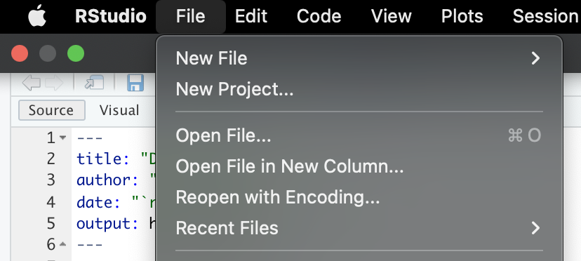
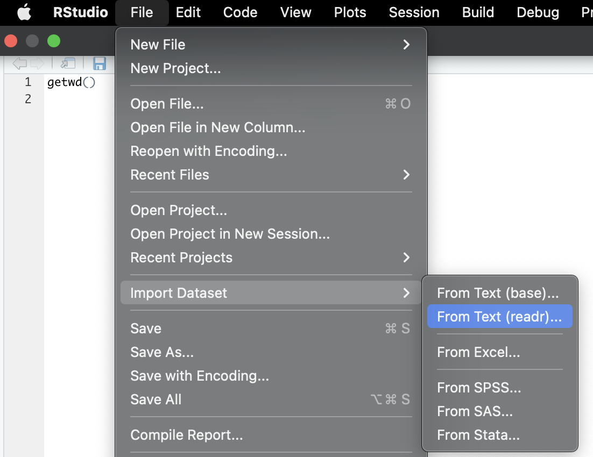
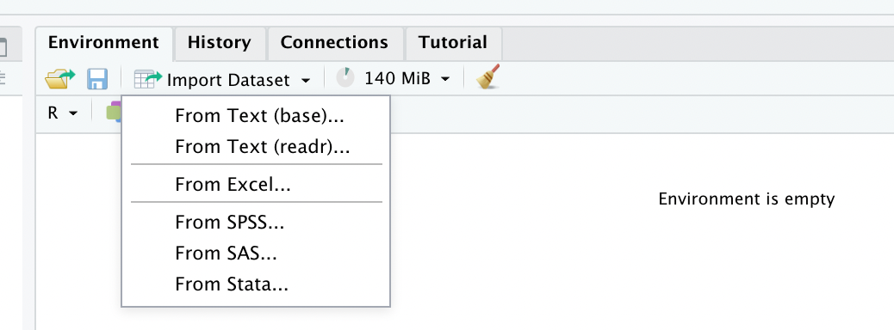
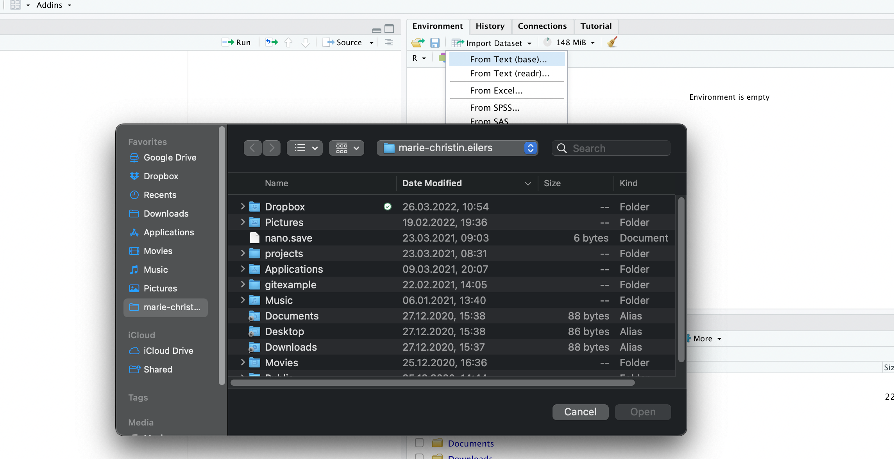
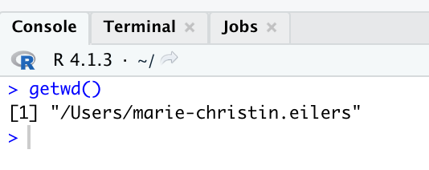
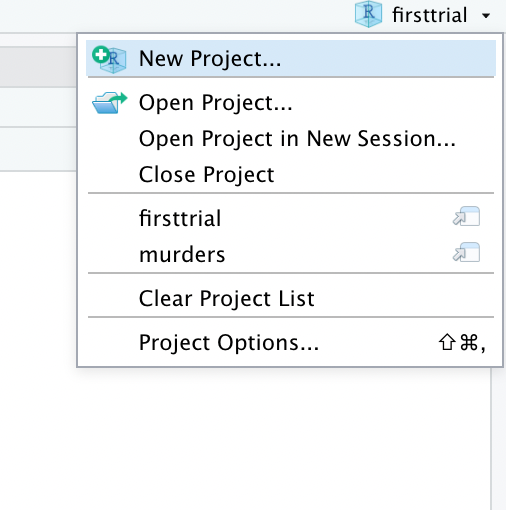
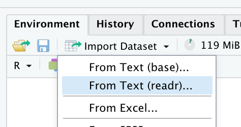
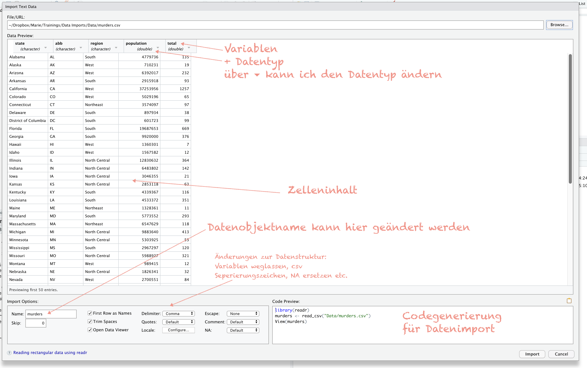
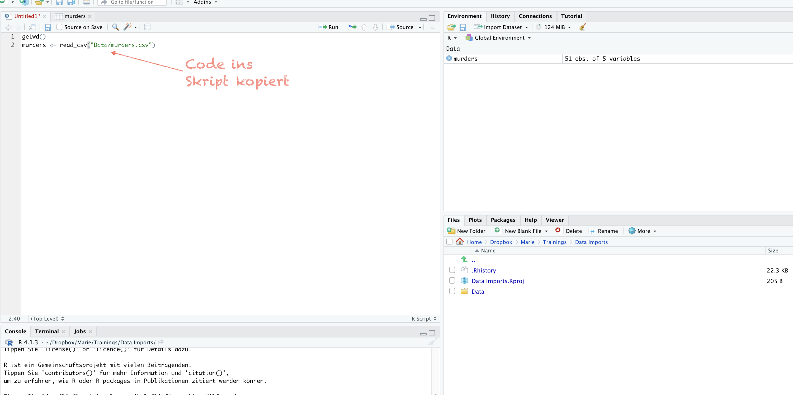

```{r setup, include=FALSE}
knitr::opts_chunk$set(echo = TRUE)
```

## Daten importieren

###  1. Möglichkeit: Flat File vom lokalen Computer

\
Sehr üblich ist das Laden der Daten vom lokalen Computer.\
R guckt standardmäßig nach diesen Datensätzen in dem festgelegten Arbeitsverzeichnis.\
Also, wie geht's nun?\
Ich kann über das Menüband keine Datei öffnen. Damit öffne ich nur und ausschließlich R Formate!\
{width="367"}

Aber, dort finde ich eine Möglichkeit des Datenimports:

{width="393"}

Ich persönlich finde die folgende UI Möglichkeit am sinnigsten, um in den Editor von R, die Denk- und Arbeitsweise hinein zu grooven. Ich gehe auf die rechte Seite des Editors. Dort sehe ich beim Arbeiten später auch meine geladenen und erstellten Objekte, die ich in meinen Berechnungen verwenden kann. Dort lade ich auch die Daten als Objekt hinein. Über die UI geht's über den Klick auf "Import Dataset".

{width="425"}

Yep, das sind die UI Möglichkeiten fürs Importieren eines lokalen Datensatzes. Nun wird es interessant.

Der nächste Klick auf eine dieser Möglichkeiten, öffnet meinen Finder/Explorer und ich kann zum Ablageort der Datei per weiterer Klicks navigieren.



Soweit so gut. Das mache ich häufig, jeden Tag klicke ich mich durch die Ebenen meiner Arbeitsverzeichnisse. Zum anderen - diese Arbeit kann ich in R automatisieren. Klar, das hat wenig Zeitgewinn für das Hochladen einer Datei zu bieten. Aber für alle weiteren Arbeiten - vor allem wenn es ums Erstellen der R Outputs geht - *und Ergebnisse müssen nun einmal immer irgendwie kommuniziert werden* - hat das einen echten Komfortfaktor für mich.

Ich zeig mir hier mal selber - zur Dokumentation - wie es geht:

Welches Arbeitsverzeichnis spricht R an?\

```{r Get Working Directory, echo=FALSE}
getwd()
```

Das Ergebnis wird mir unten links in der Console angezeigt. Bei mir sieht's erst einmal wie folgt aus:\

{width="348"}

Ok, das Ergebnis ist nicht wirklich überraschend.

Wie ändere ich es nun?

Über die UI wie folgt:

{width="387"}

Und über Code geht's so:

`setwd("~/Dropbox/Marie/Trainings/Data Imports")`

Boah, mega aufwändig.

Also, warum der Code zum Schluß? Ich sehe immer zu, dass ich diesen Code in mein Skript bekomme. Ganz ehrlich, warum nutze ich R? Reproduzierbarkeit, Kontrolle und Flexibilität. Und das heißt eben auch, dass ich mit dem Skript, das Objekt der Daten laden möchte. Und dabei bleibt es nicht stehen. Vor dem Import setze ich das ganze Projekt auf. Inklusive des Arbeitsverzeichnisses.

Grund:

Ich habe manchmal mehrere R Studio's offen, mal nicht. Aber ich kann nahtlos springen und bin immer im richtigen Arbeitsverzeichnis mit ggf. der GitHub Anbindung.

Hier bin ich im aktuellen Projekt. Dieses nennt sich homework0. Das steht ganz oben rechts in der Ecke meines Fensters.

{width="194"}

Wenn ich auf den Pfeil klicke, sehe ich andere Projekte oder kann sie öffnen uns so nahtlos arbeiten:

{width="233"}

Dort oben gibt es auch die Möglichkeit ein neues Projekt anzulegen. Ebenso im Menüband. Genau dies ist mein erster Schritt. Ich klicke auf "New Project:

{width="269"}

Es öffnet sich folgende Seite:

{width="405"}

Da ich in diesem Fall bereits ein Arbeitsverzeichnis erstellt habe, klicke ich auf diese Option:

{width="449"}

Und gehe dann über "Browse" auf das Verzeichnis. Im Anschluss klicke ich auf "Create Project".

{width="433"}

Nun steht oben rechts in der Ecke auch mein Projekt. Alle weiteren R Dateien, die ich öffne und speichere, werden automatisch in diesem Verzeichnis abgelegt. Super praktisch.

{width="176"}

Nun lade ich .csv Daten ein. Da .csv ein Textformat ist, ist zu beachten, wie dieser Text getrennt wurde. Das kann ich checken, indem ich die Datei vorab einfach einmal mit einem einfachen Editor öffne.

Ok, die einfachste Art und Weise des Imports geht wie folgt:

{width="270"}

Es gibt zwei UI Menüpunkte für Textdateien wie .csv. Beide haben hier eine schöne UI und Vor- und Nachteile. Ich wähle im Beispiel `readr` aus.


Es öffnet sich ein PopUp. Dort browse ich nach meinen Daten. In das PopUp werden nun die Daten geladen, die Datentypen angezeigt. Außerdem kann ich den Namen meines Datenobjektes für mich anpassen und den Code anschauen. 

Mit dem Klick auf den Button "Import" öffnet sich der Datenpreview & der Code wird in der Console ausgeführt. Außerdem sind die Daten nun in dem "Environment" als Objekt zu sehen.


Mein Fazit: Die UI über readr ist gut, um schnell und einfach Daten zu importieren und erste Anpassungen vorzunehmen. Aber warum nutze ich R? Für Automatisierungen und Wiederholbarkeit. Ich kopiere also den generierten Code ins Skript. Das hat den Vorteil, dass wenn ich den Datensatz im Arbeitsverzeichnis update/austausche oder sonst wie bearbeite, das Skript diese Daten neu lädt, wenn der Code läuft. Und genau das möchte ich. Von daher: Code copy und paste ins Skript.



Und nun ist das Ziel erreicht: Daten sind in R eingelesen.

Und nun ist es auch kein Geheimnis, dass die Ansprüche mit den Anwendungsfällen steigen. R Cheatsheets helfen, wenn ich direkt im Code die Anpassungen vornehmen möchte. [Hier liegt das Datenimport Cheatsheet.](https://raw.githubusercontent.com/rstudio/cheatsheets/main/data-import.pdf)
