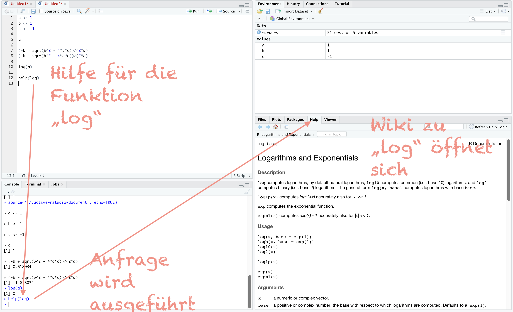
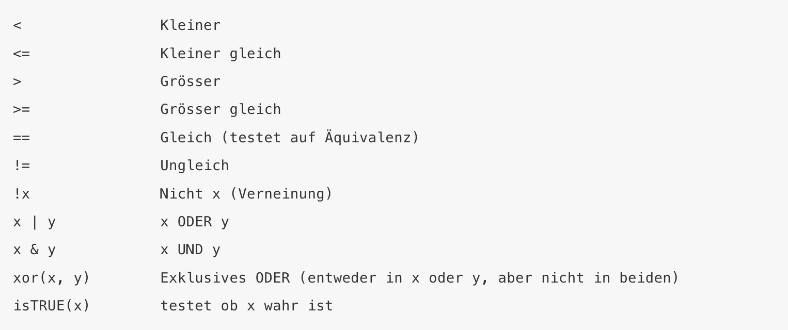

\

## Angstfreie Einführung - erste Schritte

\

### Was kostet R?

Open-source Software.\
Kostenlos.\

### Wo herunterladen?

*1. Schritt*: R herunterladen:{width="30"} <https://www.r-project.org/>\
*2. Schritt*: R Studio Desktop herunterladen: {width="70"} <https://www.rstudio.com/products/rstudio/download/>\

### Was ist R?

R ist eine Programmiersprache, die von Statistikern entwickelt wurde.\
R ist wohl nicht vergleichbar mit anderen Software Engineering Softwares.

*Attraktiv an R ist:*\
- Skripte werden geschrieben - wiederholbar (reproducable work zu jedem Zeitpunkt)\
Skripte können in jedem Texteditor gespeichert, bearbeitet und geteilt werden\
Das kann ich in Statistica, SPSS oder Tableau nicht\
Ich kann diese Skripte mit jedem und jeder weltweit einfach teilen. Ein großer großer Pluspunkt im Vergleich zu Point & Click Software Dateien, die dann eben nicht jeder verwenden kann - sondern nur derjenige mit der entsprechenden Lizenz.\
- Open Source\
- Kostenlos\
- Muliplattform (Linux, MacOs, Windows)\
- große, weltweite, aktive Gemeinschaft von R Nutzern auf Stackoverflow - viele Ressourcen, um zu Suchen und Fragen zu stellen\
- Add-Ons für neue Data Science Anwendungen von einer Community\

### Aufbau von {width="100"}

Man arbeitet nach der Installation von R und R Studio nur noch mit R Studio. D.h. nur dieses eine Programm starte ich.\
R Studio ist eine sogenannte IDE (Integrated Development Environment).\
D.h. hier kann ich schreiben, welche Auswertungen gefahren werden sollen (Editor), kann diese Auswertungen durchführen (Console), sehe welche Daten, Variablen, Verbindungen, usw. ich eingerichtet habe und sehe zu guter letzt auch meine Ergebnisse.

{width="639"}\

### Ausführen von Skripten

Die bisher beschriebenen Zeilen Code wurden im Skriptfeld von R Studio eingetragen.\
Dieses kann ich abspeichern, in anderen, "normalen" Texteditoren weiterbearbeiten und versenden, usw. Editoren arbeiten meist so, dass sie den Code besser lesbar machen. Sie geben einem automatische Vorschläge an, setzen Klammern automatisch und heben Formelteile farbig unterschiedlich hervor.\
R Studio ist einer dieser Editoren.\
Ein Vorteil von R Studio gegenüber anderen Editoren ist der, dass ich sehr einfach meinen Code testen kann, während ich ihn schreibe.\
Ein neues Skript öffne ich über das + oben links im Editor. Dies kann benannt werden, indem ich auf Speichern klicke und ihm einen Namen gebe.\
\
Beispielhafte Eingabe erster Zeilen Code im R Skript:\
a) Laden der Libraries, die ich nutzen möchte.\
b) Datenimport\
c) Grafik zur explorativen Datenanalyse\

\

`library(tidyverse)` # Laden des packages "tidyverse" \
`library(dslabs)` # Laden des packages "dslabs" \
`data("murders")` # Laden des Datensatzes "murders" \
`murders %\>% ggplot(aes(x=population, y=total, label=abb, color=region)) + geom_label()` # Erstellen einer ersten Grafik`

\

#### Wie sehe ich nun, zu welchem Ergebnis dieser Code im Editor führt?

Drücken im Skript selber von folgender Tastenkombi:\
Command + Shift + Return\
*oder*\
Ctrl + Shift + Enter\

*oder:*\
"Run" Button in R Studio\
{width="63"}\

Die Code-Ergebnisse erscheinen nun in der Console unten links.\
Der Graph erscheint in der View Pane rechts. Hier kann die Grafik gezoomt werden, exportiert werden, etc.\
Welche Daten ich geladen habe, sehe ich oben rechts.\
{width="622"}

Wenn ich nur eine Zeile Code im Editor laufen lassen möchte, dann lediglich die folgenden Tastenkombis drücken:\

Command + Return\
*oder*\
Ctrl + Enter\
\

### Grundlegendes in R \
a) R ist case-sensitive, d.h. unterscheidet zwischen Groß- und Kleinschreibung.\
    -  Variablen benenne ich daher nur in Kleinbuchstaben \
b) R verwendet den Punkt . als Dezimaltrennzeichen \
c) Fehlende Werte werden durch NA gekennzeichnet \
d) Auskommentiert wird durch # Hashtag \
e) Variablennamen sollten mit einem Buchstaben beginnen. Leerzeichen vermieden werden \
f) Inhalt der Variable anzeigen: Variable schreiben und Code ausführen \
g) Nur Daten oder Objekte in der Default Ansicht oben rechts, also Environment oder Daten, kann R verwenden. \
\

### Objekte\

Objekte sind Datenstrukturen, also die Art und Weise wie Daten dargestellt werden. Zwei Arten sind von besonderer Bedeutung: Vektoren und Dataframes. Vektoren sind die technische Grundstruktur einer Variablen in R, Dataframes sind die R Struktur der Excel Tabelle. Eine neue Variante von Dataframes nennt sich tibble. \

Vor dem Start in R, müssen wir einige Grundkonzepte kennenlernen.\
Hier eignen sich bereits die mathematischen Gleichungen als Einstiegsszenario.\
Ich möchte folgende Gleichung lösen.\
\
$a x^{2}+b x+c=0$\
\
Ich kann nach x lösen und erhalte:\
\
$\frac{-b \pm \sqrt{b^{2}-4 a c}}{2 a}$\
\
In einer Programmiersprache kann ich Variablen allgemein halten und somit bleibt auch die Gleichung allgemein.\
So, ich fange an:\
Ich möchte die Gleichung lösen für:\
a = 1\
b = 1\
c = -1\
\
Im R Studio Editor gebe ich folgendes ein:

```{r Variablen mit Zahlen belegen}
a <- 1
```

```{r}
b <- 1
```

```{r}
c <- -1
```

Achtung: In R nutzt man diese Sympbole statt dem Gleichheitszeichen. Es ist ein "kleiner als" und ein "Minus" Zeichen. Dies ist der Standard der gelehrt wird. Offenbar geht in den meisten Gleichungen auch das = Zeichen.\

Diesen Code lasse ich nun in der Console laufen.\
Nichts passiert. Also nichts wird in der Console als Ergebnis angezeigt. Das ist gut! Hätte ich einen Fehler gemacht, so hätte ich hier eine Fehlermeldung erhalten.\
\
Nun möchte ich aber sehen, wie die Console mir etwas ausgibt. Also hier das erste Beispiel.\
Schreiben von

```{r Was ist Variable a für ein Wert?, eval=FALSE}
a
```

Und ausführen des Codes führt zur Ausgabe von

`{r} a`

Diese Vorgehensweise entspricht derer, die ich weiterhin verwenden werde.\
Eine explizitere Vorgehensweise wäre folgende, zur Ausgabe des Wertes der in Variable a gespeichert wurde:\

```{r}
print(a)
```

Auch hier wird ausgegeben, dass a=1 ist.\
\
In diesem Beispiel ist a eine Variable. In R kann diese Variable ein Objekt sein. Später werde ich komplexere Objekte als Inhalte zeigen. Grundsätzlich ist der Code aber immer gleich: Ich tippe das Objekt in R ein, und erhalte als Ergebnis das, was im Objekt gespeichert ist.\

Wenn ich alle Objekte sehen möchte, die in meinem Workspace gespeichert sind, gebe ich folgendes ein:

```{r Sehen aller Objekte}
ls()
```

Im grafischen Interface von R, R Studio, befindet sich diese Anzeige auch stets sichtbar hier:\

\

Um nun endlich die Lösung für die obige Gleichung zu berechnen, gebe ich diese in das Skript ein und lasse den Code ausführen. Das Ergebnis findet sich dann in der Console.\
`(-b + sqrt(b^2 - 4*a*c))/(2*a)`\
und für die zweite:\
`(-b - sqrt(b^2 - 4*a*c))/(2*a)`\
Das Ergebnis ist 0,62 bzw. 1,62.\
{width="393"}\
\

### Funktionen

Ich habe einige vorprogrammierte Funktionen. `ls()`und `sqrt(x)` habe ich bereits verwendet. Meist muss in den Klammern nach der Funktionsangabe allerdings ein Eintrag zwischen den Klammern stehen. Zum Beispiel der Logarithmus von a, welches 1 war, ist 0.\

```{r}
log(a)
```

\
Funktionen können auch "nested" sein, d.h. verschachtelt. Ein Beispiel:\

```{r Nested Funktion}
log(exp(1))
```

\
Hier wird von innen nach außen berechnet. Also erst exp(1) und dann dieses Ergebnis log().\

Es gibt viele pre-build Funktionen, so wie:\

-   Pi:\

```{r}
pi
```

-   Unendlichkeit:\

```{r}
Inf
```
\

#### Hilfe

Die Hilfe gibt nützliche Informationen dazu, was zum Beispiel Funktionen für Argumente benötigen.\
Beispiel\

`help(log)`

\


\
Die meisten Hilfethemen kann ich auch wie folgt abfragen:\

`?log`\
Und wenn ich wissen möchte, welche Argumente die Funktion benötigt, dann erfrage ich dies durch folgende Zeile:\

```{r Argumente Hilfe}
args(log)
```

\
Diese kann ich nun wie folgt anwenden für mein Bedürfnis:\

`log(100, 10)`\
oder ich kann auch schreiben:\

`log(x=100, base=10)`\
Wenn ich Operatoren abfrage, dann muss ich Anführungszeichen verwenden:\

`?"+"`

\

### Installieren von Statistikmodulen, wenn weitere benötigt werden \

Frisch installiert bietet R nur einen kleinen Teil der Funktionen, die man insgesamt nutzen kann.\
Die erste Lieferung nennt man: base R\
Die extra Funktionalität kommt von externen Entwicklern. Es gibt hunderte dieser add-ons.\
Da nicht jeder, jede Funktionalität benötigt, werden diese in Packages angeboten. Diese Packages sind sehr leicht innerhalb von R selber zu installieren.\


\

#### Installation über Code: \

Ich kann packages über Codeeingabe im Skript, oder über das R Studio im Menü laden.

*So installiere ich ein Package namens dslabs per Code:*

{width="400"}

Diesen Code gebe ich im Skript ein:\
`install.packages('dslabs')`

\
R installiert dann dieses package. Vorraussetzung ist eine Verbindung mit dem Internet.

Wenn ich einmal ein package installiert habe, muss es nicht wieder installiert werden.\
Ich muss es dann nur in meine Auswertung mit dem library() Befehl laden.\
\
*zwei Packages oder mehr zu installieren:*

`install.packages("dslabs", "tidyverse")`\

\

#### Installation über das Menü von {width="80"}

Die Statistik packages können auch über das Menü, und damit ohne Code installiert werden.\
Tools -- Install packages

{width="333"}

Erinnerung: Ich brauche die Packages nie wieder zu installieren. Trotzdem ist es hilfreich die Installation im Skript zu haben, falls man R neu installieren muss.\
*Packages werden nicht in R Studio installiert, sondern in R selber.*

So kontrolliere ich, welche Statistik packages ich bereits installiert habe:\
`installed.packages()`\
\

#### Nach dem Installieren von Statistik Software muss das Packet in die laufende Auswertung geladen werden

Nun muss ich die package-Installation noch in meine laufende Auswertung (Session) laden. Hierzu gebe ich folgendes ein:

```{r Laden des package dslbs}
library(dslabs)
```

{width="353"}\
\

### Datensätze

Ich lade das package "datasets".\

`install.packages("datasets")`

\
Und schaue welche Datensätze dieses Packet mir geliefert hat:\

```{r Welche Daten sind drin?}
data()
```

\
Um mir eins anzuschauen, gebe ich den Namen ein. Es wird nun angezeigt.\

```{r}
CO2
```

### Motivation für die Einführung

Die nachfolgenden ersten Übungen beziehen sich auf die Erschießungs-Tötungsraten der USA - ich möchte bestimmen wohin ich ziehen könnte wegen dem Job, und wohin ich lieber nicht umziehen würde.

Grundsätzlich gilt für die Arbeit mit Daten:\
- Wenn ich Daten sehe, bin ich eher erst einmal kritisch abwartend. Schau welche Daten gezeigt werden und vor allem welche nicht gezeigt werden. - kritisch und neugierig sein - große Notwendigkeit der Interaktivität und von schnellen flexibeln Analysen im Feld Data Science

### Datentypen

Bestimmung der Klasse der Daten:\

```{r Klasse bestimmen}
class(a)
```

\
Variable a ist also numerisch.\
oder:\

```{r Klasse bestimmen Funktion}
class(ls)
```

ls() ist also eine Funktion\
\
Bislang haben wir nur einen Wert in einer Variablen gespeichert. Aber in der praktischen Arbeit kommen solche Beispiele selten vor. Nun zeige ich die Datentypen, mit denen tatsächlich gearbeitet wird:\

**Data Frame**\
Diese kann ich mir wie eine normale Excel Tabelle vorstellen. Die Spalten stehen für Variablen und die Zeilen für Beobachtungen.\
In einem Data Frame kann ich verschiedene Datentypen in einem Datensatz vereinen. Das entspricht dem realen Vorliegen der meisten Daten. Folgender Datensatz entspricht einem Data Frame. Dieser ist im Beispielpackage bereits enthalten:\
`install.packages("dslabs")`\
Laden des packages:\

```{r Packet laden}
library(dslabs)
```

Laden der Daten:\

```{r Daten aus package laden}
data("murders")
```

Abfrage des Datentyps:\

```{r Datentyp des Datensatzes}
class(murders)
```

Ich sehe, es ist tatsächlich ein Data Frame.\
*R ist eine Objektbezogene Sprache. Es wurden also Daten im Objekt "murders" gespeichert.* Dies ist ein wichtiger Hinweis. Ich werde später sehen, dass es sehr üblich ist, Daten in Objekten zu speichern und mit diesen Objekten die Analyse fortzusetzen.\

Was für eine Struktur hat der Datensatz?\

```{r Struktur des Objekts murders}
str(murders)
```

Data-Frame\
51 Beobachtungen mit 5 Variablen.\
Die Variablen heißen: state, abb, region, population, total\
Es werden einige Inhalte der Variablen dargestellt.\

Über die head() Funktion kann ich mir die ersten 6 Zeilen des Data Frames anzeigen lassen:\

```{r Erste 6 Zeilen Tabellen preview}
head(murders)
```
\

#### Wie ich mit Variablen in R arbeite:

Und zwar mutet das erst einmal komisch an. Wenn ich in R die Variablen verarbeite, also in Formeln beispielsweise verwende, oder in einer Grafik, so spreche ich die Variable immer mit dem Datensatz, dem Dollar Zeichen und dem Variablennamen an. \

`murders$state`ist ein Beispiel um die Variable state zu verwenden.\

Ich muss häufiger beim Arbeiten mit den Daten, nach den genauen Variablennamen schauen. Eine kurze Möglichkeit bietet R über folgende Abfrage:\

```{r Variablennamen abfragen}
names(murders)
```

Eine einzige Variable in diesem Datensatz ist keine Zahl, sondern ein **Vektor**. Rein technisch wäre auch unsere Variable a=1 ein Vektor. Allerdings stelle ich mir eher eine Variable mit vielen Einträgen/Beobachtungen unter einem Vektor vor.\
Die Funktion length() gibt die Anzahl der Einträge im Vektor aus.\

```{r lenght}
length(murders$state)
```

Es gibt numerische, character, logische (TRUE oder FALSE) und factors Vektoren in R. Factors sind Variablen, die kategorische Daten speichern. Es gibt zum Beispiel im murders Datensatz nur 4 Regionen, also 4 Kategorien. Jeder Staat gehört zu einer dieser Kategorien. Ich kann diese Kategorien in R erfragen indem ich folgende Funktion verwende:\

```{r levels}
levels(murders$region)
```

\
Warum R das anbietet? R speichert zu jeder Kategorie im Hintergrund eine Ganzzahl. Ich denke, dass kennt jeder der bereits mit SPSS gearbeitet hat.\
Erkennen kann niemand von außen ob die Variable eine Textvariable ist oder ein Factor. Dies muss erfragt werden.\

### Vektoren

Die kleinste Basiseinheit in R, sind Vektoren. Auch große Datensätze können in der Regel in Vektoren heruntergebrochen werden. Jede Spalte ist in der Regel ein Vektor. Hier nun eine kurze Einführung, wie Vektoren kreiirt werden. Ist unwichtig, denn meist arbeite ich mit "fertigen" Datensätzen. Aber kleine Fingerübungen sind ja nicht schädlich :-).\

#### Vektor kreiiren

Ich gebe Daten für einen numerischen Vektor wie folgt ein:\

```{r Numerischer Vektor}
anzahl <- c(5, 4, 3)
```

Das c steht für "concatenate" oder "combine".\
Einen Textvektor gebe ich wie folgt ein:\

```{r Vektor character}
spiele <- c("Handball", "Fußball", "Judo")
```

Hierbei die "" beachten.\
Ich kann die beiden Vektoren auch bereits kombiniert eingeben:\

```{r Kombi Vektor}
spielanzahl <- c(Handball=5, Fußball=4, Judo=3)
```

Ich schaue was dabei rauskommt:\

```{r Kontrolle Kombivektor}
spielanzahl
```

Ich kann das obige auch über die names() Funktion erreichen:\

```{r Names: Zusammenfügen Vektor}
names(anzahl) <- spiele
```

```{r}
anzahl
```

\

#### Sequenz\
Oft kreiert man offenbar auch Sequenzen. Das geht so:\

```{r Sequenz}
seq(1, 10)
```

\

#### Subsetting\
Nun wird es wirklich praxisrelevant. Subsetting. D.h. wie picke ich mir bestimmte Spalten oder Zeilen für die weiteren Analysen heraus?\
Hier, bitte nur die Spalte 2 verwenden. Dazu verwende ich die eckigen Klammern:\

```{r Spalte 2 Subsetting}
anzahl[2]
```

Um zwei oder mehr Spalten zu wählen, verwende ich wieder das c() von combine:\

```{r Mehrere Spalten wählen}
anzahl[c(2,3)]
```
Und schreibe ich das Minus davor, so wird diese Zeile ausgelassen: \
```{r Eine Zeile aussparen}
anzahl[-2]
```
Und ich kann natürlich auch Bedingungen abfragen: \
```{r Bedingung abfragen Subsetting}
anzahl[anzahl>4]
```

Möchte ich nun einen Dataframe ansprechen, so tue ich dies wie folgt: \
Eine Variable:\
```{r}
murders[[1]]
```
oder direkt über die Spaltenbezeichnung: \
```{r }
murders$state
```
Eine Zeile in einer Variablen. Hier Zeile 1: \
```{r Variable und Zeile in Data Frame}
murders$state[1]
```
Und es geht auch so. Erster Wert ist die Zeile, zweiter die Spalte. \
```{r}
murders[1,1]
```

\

#### Konventionen: Namen \
Woran ich mich orientiere:\
Übergreifend: \
- treffend  
- kurz  
- konsistent  
\
Konkret:\
- nur Kleinschreibung \
- Unterstrich verwenden \
- vor Ziffern nicht notwendigerweise Unterstrich verwenden \
- keine Umlaute und Sonderzeichen \
- Objektnamen nicht mit Ziffern beginnen \
\
Beispiele: \
- Mittelwert berechnet: _avg \
- weiteres: _md, _sd, _min, ... \
- fehlende Werte entfernt: _nona \
- Daten langes Format: _long \
- Daten vereinigt: _joined \
- Anteile: _prop \
- zentrale Daten: data \
- Rohdaten: _raw \

Hilfreich finde ich auch den [Google Styleguide für R Namen](https://google.github.io/styleguide/Rguide.html)

\


#### Datentypanpassung:

Noch etwas sehr gängiges: Ich passe den Datentyp an. Zum Beispiel habe ich eine Variable, also einen Vektor mit Zahlen. Diese sollen aber eigentlich Textwerte darstellen.\

```{r Kreiren von Werten}
betriebsnummer <- c(13445, 56668, 98887)
```

R vermutet automatisch, dass es sich um eine numerische Variable handelt. Ich frage es ab:\

```{r}
class(betriebsnummer)
```

Ok, nun hin zu Text konvertieren:\

```{r Variablentypkonvertierung}
as.character(betriebsnummer)
```

Kontrolle des Datentyps:\

```{r Kontrolle Datentypänderung}
class(betriebsnummer)
```

Wie aus anderen Programmen gewohnt, nutzt R die Angabe "NA" für fehlende Werte.\
Die werden häufig bereits im Datensatz fehlen. Können aber auch durch Datentypanpassungen entstehen. Ein Beispiel:\

```{r Koercion NA}
x <- c(1, "b", 3)
```

```{r Datentyp}
class(x)
```

Datentypumwandlung dieses Vektors:\

```{r Datentypumwandlung as.numeric}
y <- as.numeric(x)
```

In oben stehender Berechnung ist nun ein interessanter Aspekt hinzugekommen. Ich habe erst die Daten der Variable x zugeordnet. Und dann diese Variable weiterverwendet. Dies wird häufig gemacht um zum Ursprung zurückkehren zu können. Aber für die Konvertierung, habe ich die neue Variable y genannt. Praktisch dupliziert und der neuen Variable einen anderen Datentyp zugewiesen.\

```{r}
y
```

Ich sehe ich nun final, dass b nun zu NA konvertiert wurde.\

\

### Datenimport \

Für die ersten Übungen habe ich einen Datensatz aus einem Statistikpacket geladen. D.h. diese Daten lagen bereits mit dem Laden der Statistikerweiterung vor. Diese Testdatensätze werden häufig von Statistiksoftwareanbietern mitgeliefert - fürs Üben, Demonstrieren, die ersten und weiteren Schritte. \
Nun ist der normale Anwendungsfall aber der, dass ich Daten ins Statistikprogramm importiere. Heute gibt es eine Vielzahl von Importfunktionen in R - Flat files wie .csv oder Excel Dateien, bis hin zu SQL Abfragen, Datenbankverknüpfungen o.ä. \
\
**Laden von Beispieldaten aus einem Statistikpacket:** \
Ich kann entweder den folgenden Weg gehen: \
```{r}
library(dslabs)
data(murders)
```

oder die Daten über folgendes Codeschemata laden: \
`data(dataset, package="package")``
wie zum Beispiel:\
```{r}
data(murders, package="dslabs")
```
\

**Laden einer lokalen .csv Datei:**\


### Sortieren von Daten

Sortieren vom niedrigsten zum höchsten Eintrag, funktioniert mit der sort() Funktion. Ich bleibe dazu im mitgelieferten Datensatz "murders".\

```{r Sortieren}
sort(murders$total)
```

Schön zu sehen ist, dass der Vektor nun sortiert ausgegeben wird. Der US-Statt mit der niedrigsten Schußwaffen Tötungsrate hat 2 Tote, der Staat mit den höchsten Zahlen hatte 1257 Fälle.\
Allerdings kann ich damit nur diesen einen Vektor sortieren, aber nicht sehen, welcher Staat zugehörig ist. Dies kann ich mit der Funktion order() erreichen.\
Ich speicher die Sortierung in der Variable order ab. Und verwende sie im Anschluss um die Staatenabkürzungen nach dieser sortierten Variable sortieren zu lassen (Eigentlich ist Order eine indexierte Variable. Ich erkläre das hier mal nicht näher, denn tatsächlich gibt es im package tidyverse eine viel schönere und einfacher verständliche Lösung um Daten zu sortieren und die werde ich auch im Alltag nur nutzen).

```{r oder}
order <- order(murders$total)
```

Sortieren der Staatenabkürzungen:\

```{r}
murders$abb[order]
```

VT hat also die niedrigsten Tötungsraten und CA hat die höchsten Tötungsraten.\
Das Maximum kann ich jedoch auch wie folgt berechnen:\

```{r Max}
max(murders$total)
```

Und das Minimun über folgenden Code:\

```{r Minimum}
min(murders$total)
```

Eine weitere Funktion, die ich häufig in anderer Software nutze ist der Rang. Der kann hier in R wie folgt abgefragt werden:\

```{r Rank}
rank(murders$total)
```

\
#### Vektor Arithmetik\
\
Wie arbeite ich mit Vekoren?\
CA also Kalifornien hatte die hächsten Tötungsraten aber auch die höchste Population. Wie in anderen Statistikprogrammen auch, führt R die Vektoroperationen "element-wise" durch. Ich berechne also die Tötungsrate wie folgt für jeden Staat:\

```{r Tötungsrate}
toetungsrate <- murders$total / murders$population * 100000
```

Nun sortiere ich die Staaten nach Tötungsrate:\

```{r Staaten nach Tötungsrate, sortiert}
murders$state[order(toetungsrate, decreasing=TRUE)]
```

Kalifornien ist somit nicht mehr der bedenklichste Staat als Möglichkeit meiner beruflichen Veränderung. District of Colombia ist im Falle der Tötungsrate der bedenklichste Zielort.\

### Operatoren, Logicals

Nun zeige ich kurz die Indexierung.\
Die Tötungsrate soll kleiner oder gleich dem Verhältnis von 0,71 sein:\

```{r Tötungsrate kleiner gleich 0,71}
index <- toetungsrate <= 0.71

```

D.h. nun für das Ergebnis:\

```{r Index}
index
```

D.h. wieder wird R durch jeden Fall element-wise durchgehen und schaut einzeln ob die Bedingung gegeben ist oder eben nicht. Dort wo TRUE ausgegeben wird, ist die Bedingung erfüllt.\
Nun schaue ich für welche Staaten, die Bedingung erfüllt wird:\

```{r Staaten unter 0,71}
murders$state[index]
```

Wenn ich die Summe des Logicals (hier: Index) nehme, dann wird der Logical zu 0 und 1 numerisch. D.h. TRUE erhält die 1 und FALSE die 0. Diese Werte werden bei sum() aufsummiert.\

```{r Summe Index}
sum(index)
```

Hier eine Liste möglicher Operatoren:\
\

Also in die Anwendung:\
Ich möchte im Westen der USA leben und die Tötungsrate soll unter 1 liegen.\

```{r Westen}
west <- murders$region == "West"
```

und\

```{r Tötungsrate unter 1}
sicher <- toetungsrate <=1
```

\

Diese kombiniere ich nun zu:\

```{r Kombi aus West und sicher}
index <- sicher & west
```

Und in welche Staaten könnte ich nun ziehen?\

```{r Sicher und West Staaten}
murders$state[index]
```

\

#### Indexing Funktionen\
- which - match - %in%

Ich starte mit **which()**.\
which() gibt mir die Einträge des Vektors, die TRUE sind. Also, ich definiere zunächst einen Vektor als logical:\

```{r logalc für which}
x <- c(TRUE, FALSE, TRUE, TRUE, FALSE, FALSE, FALSE, FALSE, TRUE)
```

Nun wende ich `which()` an um zu erfragen, welcher Eintrag TRUE ist.\

```{r which()}
which(x)
```

\
Dies kann ich zum Beispiel anwenden um herauszufinden, wie die Tötungsrate in Illinois ist:\

```{r Index von Illinois}
index <- which(murders$state == "Illinois")
```

Und dies verwende ich in:\

```{r Tötungsrate in Illionis}
toetungsrate[index]
```

\
Nun geht es über zu **match()**\
Hier ist es erforderlich, dass mehrere Bedingungen erfüllt sind:\

```{r match()}
index <- match(c("California", "Texas", "New York"), murders$state)
```

Das erste Argument zählt die Bedingungen auf, das zweite Argument die Variable aus der die Bedingung kommt.\

Kontrolle ob der Index richtig gesetzt wurde.\

```{r Kontrolle Index}
murders$state[index]
```

Nun schaue ich mir noch die Tötungsraten dieser drei Staaten an:\

```{r Tötungsraten match()}
toetungsrate[index]
```

\
Nun geht es noch um einen häufigen Operator in R. Den **%in%** Operator:\
Mit diesem kann ich schauen ob ein Vektor in einem anderen Vektor enthalten ist.\
Ein Beispiel:\

```{r Vektor definieren für %in%}
 x <- c("a", "b", "c", "d")
```

Und einen zweiten Vektor:\

```{r}
y <- c("a", "d", "f")
```

Nun verwende ich die Abfrage wo es Dopplungen in x von y gibt:\

```{r }
x %in% y
```

Und andersherum, wo wird y von x überschnitten?\

```{r }
y %in%x
```

Ein einfacher Anwendungsfall. Ich möchte wissen, ob Washington, Dakota, und Boston Staaten im Datensatz sind.\

```{r Anwendungsfall}
c("Washington", "Dakota", "Boston") %in% murders$state
```

Ich sehe, dass nur Washington ein Staat des Datensatzes ist.\
\
\
#### dyplr package\
\
Meist werden allerdings Datentabellen gefiltert, sortiert, usw. Dazu gibt es ein Statistikpackage, dass das Leben erheblich erleichtert. Ich installiere es und lade es in meine [[Session:\\\\](Session:\){.uri}]([Session:\\](Session:)%7B.uri%7D){.uri}

```{r}
library(dplyr)
```

Die ersten drei Standardfunktionen möchte ich zeigen:\
- neue Spalte erstellen oder Spalte ändern: `mutate()`\
- spezielle Zeilen auswählen / filtern: `filter()`\
- bestimmte Spalten auswählen: `select()`\
- Eine Funktion an die nächste senden: %\>% (command + Shift + M)\

\
Nun möchte ich den Vektor toetungsrate in meinen Data Frame integrieren. Das kann ich mit mutate().\

```{r}
murders <- mutate(murders, toetungsrate=total/population * 100000)
```

Ich nenne also zunächst den Datensatz. In der Funktion mutate() ist der urspprüngliche Datensatz das erste Argument, das zweite Argument ist dann die veränderte/berechnete Variable.\
Im dplyr package benötige ich auch nicht die Variablenauswahl mit \$. Dadurch wird es sehr viel besser lesbar.\
Nun einmal zur Bestätigung. Ist die toetungsrate im Datensatz enthalten?\

```{r toetungsrate im Datensatz?}
head(murders)
```

Im nächsten Schritt, möchte ich nur noch Staaten sehen mit einer Tötungsrate niedriger als 0,71. Ich nutze filter().\

```{r Einfiltern Datensatz}
murders <- filter(murders, toetungsrate <=.71)
```

Und im nächsten Schritt wähle ich lediglich drei Spalten aus dem gesamten Datensatz für weitere Analysen aus:\

```{r Selektieren Spalten}
murders <- select(murders, state, region, toetungsrate)
```

Das Ergebnis sieht nun wie folgt aus:\

```{r dply Anwendung final}
head(murders)
```

Und all diese Schritte kann ich mit dem Pipe Operator ( %\>% ) in einem Schritt durchführen. Zunächst gebe ich die Daten in die Berechnung und führe dann nach und nach die Berechnungen durch.\

```{r}
murders %>% 
        select(state, region, toetungsrate) %>% 
        filter(toetungsrate <=0.71)
```

### EDA Explanotary Data Analysis

Wir untersuchen zunächst unsere Daten visuell. Das tun wir um die Daten besser zu verstehen - wo kommen sie her, wie sehen sie aus, sind sie normalverteilt oder biased? Erst im nächsten Schritt formulieren wir Hypothesen und Modelle. Die Intuition zu den Daten und zum Arbeitsfeld zu entwickeln ist der erste wichtige Schritt. Welche Variablen haben vermutlich die größte Vorhersagekraft und welche Modelle passen vermutlich am besten zu unseren Daten und Fragen.

Mindset entwickeln, dass dich neugierig macht aber genauso skeptisch bleiben lässt bei Daten.\

### Wie erstelle ich Basis Grafiken?

\
Also, ich verwende wieder den murders Datensatz. Verwende die `plot()`Funktion und setze zwei nummerische Variablen ein, damit erhalte ich einen Scatterplot.\

```{r Plot}
plot(toetungsrate, murders$total)
```

Ein Histogram erhalte ich über die Funktion `hist()`.\

```{r}
hist(toetungsrate)
```

Einen Boxplot erstelle ich wie folgt:

```{r Boxplot}
boxplot(toetungsrate~region, data=murders)
```

### Funktionen

-   Conditionals\
-   For Loops\
-   Funktionen\
    \

**Conditionals**\
\
Eine häufige Formel ist **if else**.\

```{r note}
note <- 4
```

Diese Note möchte ich in zwei Kategorien einteilen:\

```{r if else}
if(note>3){
        print("schlecht")
} else {
        print("gut")
}
```

Eine Anwendung in unserem murders Datensatz:\

```{r}
library(dslabs)
```

```{r}
data(murders)
```

```{r}
murder_rate <- murders$total / murders$population*100000
```

```{r}
ind <- which.min(murder_rate)
```

Wenn der Staat nun eine toetungsrate unter 0.5 hat, soll der Staat verwendet werden:\

```{r}
if (murder_rate[ind] <0.5){
        print(murders$state[ind])
} else {
        print("Kein Staat hat solch eine niedrige Tötungsrate")
}
```

**ifelse**:

Diese Funktion hat 3 Argumente. Eins ist der logical und zwei sind die möglichen Antworten. Wenn der locigal wahr ist, dann wird die erste Antwort ausgegeben, ansonsten die zweite.\

```{r}
notenschnitt <- c(2.5, 3.3, 1.3, 4.9)
```

```{r}
ifelse(notenschnitt < 3, "gut", "schlecht")
```

\
\
Eine mögliche Anwendung ist das Ersetzen von NAs im Datensatz durch einen anderen Wert:\

```{r}
data("na_example")
sum(is.na(na_example))
```

Es sind 145 NAs im Datensatz enthalten. Diese möchte ich nun durch 0 ersetzen und in einem neuen Vektor speichern.\

```{r}
kein_NA <- ifelse(is.na(na_example), 0, na_example)
```

Nun sollte die Summe der NAs gleich 0 sein:\

```{r}
sum(is.na(kein_NA))
```

**any()**\
Die `any()`Funktion nimmt einen Vektor von Logicals und prüft ob irgendein Eintrag TRUE ist.\

```{r any}
check <- c(TRUE, TRUE, FALSE, TRUE)
any(check)
```

**all()**\
Die all() Funktion prüft ob alle Einträge in einem Vektor TRUE sind.\

```{r all}
all(check)
```

**Funktionen**\
Manche Berechnungen führe ich immer und wieder durch. Zum Beispiel die Berechnung des Mittelwertes. Dieser berechnet sich ja wie folgt:\
`sum(x)/length(x)`\
Der Grundaufbau zum Schreiben einer neuen Funktion erfolgt so:


Ganz praktisch bedeutet dies für die Funktionsprogrammierung des Mittelwertes folgendes:\

```{r Funktion für den Mittelwert}
avg <- function(x){
s <- sum(x)
n <- length(x)
s/n
}
```

Nun verwende ich diese Funktion.\

```{r}
kinder <- 1:100
avg(kinder)
```

Das diese selbstzusammengeschriebene Funktion identisch zur mitgelieferten Funktion in R ist, kann ich wie folgt prüfen:\

```{r Prüfen ob meine selbstgeschriebe Funktion gleich der mitgelieferten Funktion ist}
identical(avg(kinder), mean(kinder))
```

**For loops**\
For loops führen eine Berechnung immer und immer wieder durch, während die Variable ausgetauscht wird. Die Variablen Range müssen wir vorher natürlich definieren, die dann einmal durchgerechnet werden soll. Die for loops Berechnung erfolgt indem man zunächst definiert was durchlaufen werden soll (für i tue diese range), und dann wird die Berechnung genannt.\
Hier die Grundform:\
 \
Ein erstes Beispiel zur Verdeutlichung: \
```{r for loops}
for(i in 1:3){
  print(i)
}
```
Nun noch ein Beispiel. Ich möchte die Summe von 1 bis 100 errechnen. Ich schreibe also erst einmal einen Vektor: \
```{r Vektor}
nSchrauben <- 100
```

Nun erzeuge ich einen leeren Vektor, in dem ich die Ergebnisse speichere:\
```{r Vektor leer}
sumSchrauben <- vector(length=nSchrauben)
```
Und nun errechne ich die Summe: \
```{r Summe}
for(i in 1:nSchrauben){
    sumSchrauben[i] <- sum(i)
}
```
```{r}
i <- 1:nSchrauben
```
```{r}
plot(i, sumSchrauben)
```
For loops werden selten in R verwendet. Warum? Es werden stattdessen folgende Funktionen regelmäßig genutzt: \
apply \
sapply \
tapply \
mapply \


